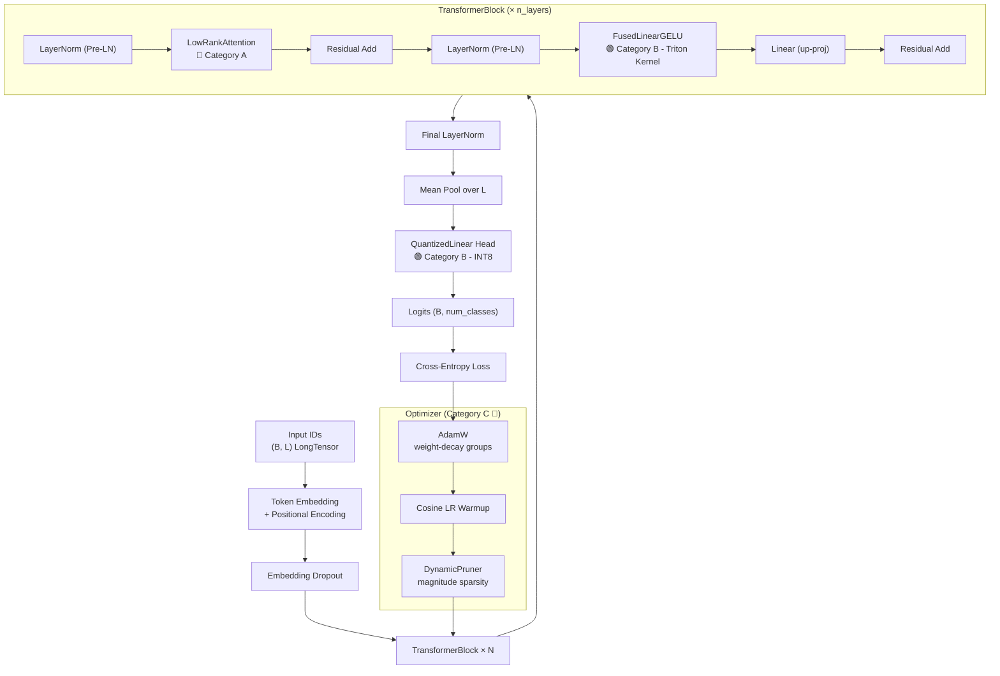
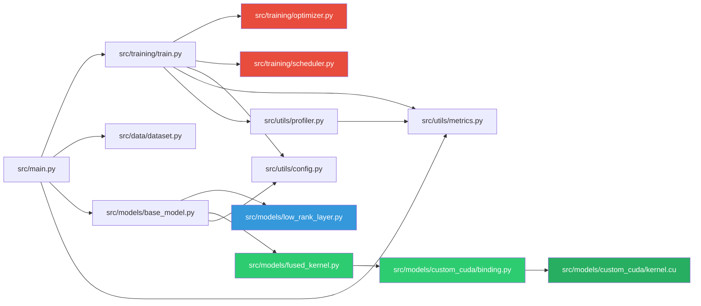
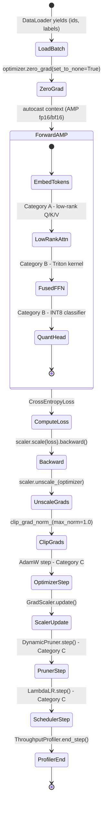
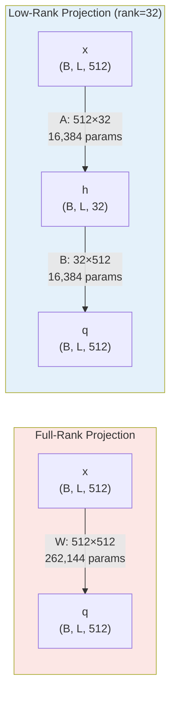
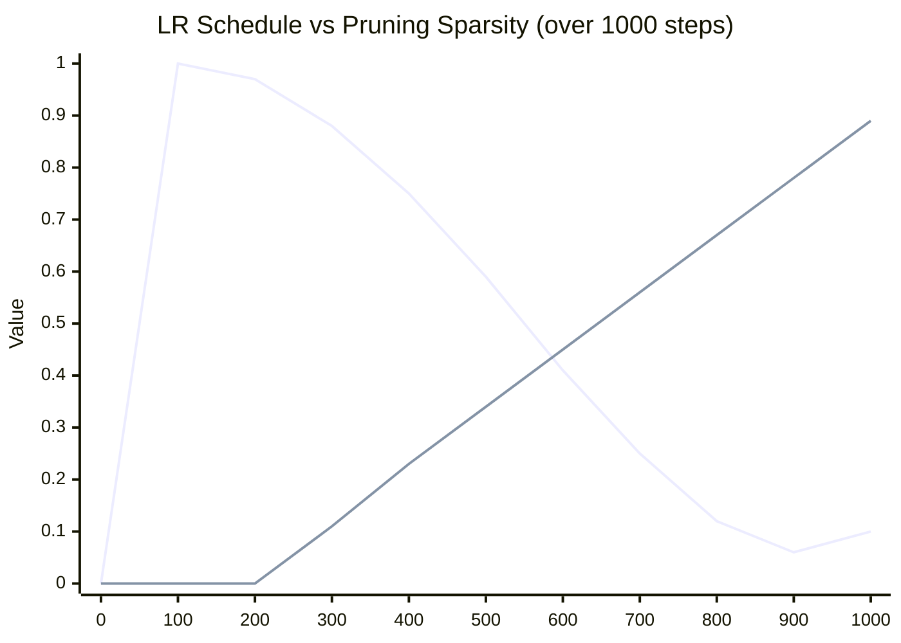

<div align="center">

# unified-ml-optimizations

**A research-grade PyTorch project demonstrating all three major categories of ML algorithmic optimization in one unified, runnable codebase.**

[](https://python.org)
[](https://pytorch.org)
[](https://triton-lang.org)
[](https://developer.nvidia.com/cuda-toolkit)
[](LICENSE)
[]()

[](https://github.com/psf/black)
[]()
[]()
[]()
[]()
[]()
[]()
[]()

*Three optimization categories. One model. Zero compromises.*

</div>

---

---

## Table of Contents

- [Overview](#overview)
- [Why This Project Exists](#why-this-project-exists)
- [Architecture](#architecture)
- [Module Dependency Graph](#module-dependency-graph)
- [Optimization Categories](#optimization-categories)
- [Training Pipeline State Machine](#training-pipeline-state-machine)
- [Tech Stack](#tech-stack)
- [Project Structure](#project-structure)
- [Quick Start](#quick-start)
- [Configuration Reference](#configuration-reference)
- [Component Deep Dives](#component-deep-dives)
- [Memory and Compute Breakdown](#memory-and-compute-breakdown)
- [LR Schedule and Pruning Interaction](#lr-schedule-and-pruning-interaction)
- [Performance Benchmarks](#performance-benchmarks)
- [Hardware Requirements](#hardware-requirements)
- [API Reference](#api-reference)
- [Extension Guide](#extension-guide)
- [Troubleshooting](#troubleshooting)
- [Glossary](#glossary)
- [References](#references)

---

## Overview

This project is a **single end-to-end machine learning codebase** that demonstrates, in one training run, the three dominant axes along which modern ML systems are optimized: mathematical structure, hardware-level kernel engineering, and training-dynamics convergence control. Rather than presenting these as separate toy examples, this codebase composes all three into a unified `OptimizedTransformer` model that can be trained from scratch on any sequence classification task.

The model is a **Pre-LN Transformer classifier** with six layers, multi-head attention, and a feedforward network - similar in structure to a small BERT or GPT encoder. Every component has been replaced or augmented with an optimization representative of its category. The attention Q/K/V projections use low-rank matrix factorization. The feedforward network uses a Triton-compiled fused kernel. The classifier head uses INT8 weight quantization. The optimizer separates parameter groups for proper weight decay. The learning rate follows a cosine schedule with linear warmup. Weights are gradually pruned during training using a magnitude-based ramp.

Understanding how these techniques compose in a single model is the core goal of this repository. Each optimization interacts with the others in non-trivial ways: a low-rank factorization changes the curvature of the loss landscape, which affects how AdamW's moment estimates accumulate. A fused kernel changes which tensors touch GPU memory, which influences cache behavior during the backward pass. Pruning modifies the effective rank of the weight matrices mid-training, altering the gradient signal for all downstream parameters. This project makes those interactions visible and reproducible.

> [!IMPORTANT]
> This project is designed to run on both CPU and GPU. All CUDA and Triton components fall back gracefully to pure PyTorch when a GPU is unavailable, so you can study the code and run smoke tests on any machine.

---

## Why This Project Exists

Most optimization tutorials isolate techniques into independent notebooks: "here is how AdamW works," "here is a Triton kernel," "here is low-rank decomposition." This is pedagogically convenient but misses the point - in real systems, these optimizations compose and interact. A low-rank layer changes the gradient landscape, which affects how AdamW's second moment estimates evolve. A fused kernel changes memory access patterns, which determines how much the learning rate schedule matters for convergence speed.

This codebase presents a **research-grade reference implementation** where every component is production-quality: NASA-style docstrings with explicit preconditions, postconditions, failure modes, and verification strategies; proper AMP (Automatic Mixed Precision) integration; gradient clipping; a profiling harness; and a Jupyter notebook for post-training analysis. The design philosophy is that you should be able to take any individual module from this repository and drop it directly into a production codebase with no modification.

The secondary goal is **explainability**. Comments describe not just what the code does, but why the specific approach was chosen over alternatives - why cosine decay is better than step decay for Transformers, why INT8 is preferred over INT4 for QAT, why the low-rank B matrix is initialized near zero, and why weight decay must be separated from biases and LayerNorm parameters.

> [!NOTE]
> The synthetic dataset used here is intentionally simple - the goal is to verify that all components integrate correctly and that the loss decreases. Swap in any real dataset (CIFAR-10, WikiText, etc.) by replacing `src/data/dataset.py` with your own DataLoader. No other files need to change.

---

## Architecture

The model is structured as a stack of identical `TransformerBlock` modules. Each block applies Pre-LN (layer normalization applied *before* the residual branch, not after), which is the key architectural difference from the original 2017 "Attention is All You Need" Transformer. Pre-LN normalization improves gradient flow at initialization, making deep models significantly easier to train at small batch sizes. The attention sub-layer within each block uses low-rank factorized projections for Q, K, and V, while the feedforward sub-layer uses a Triton-fused kernel. The final classification head uses an INT8-quantized linear layer.

The following diagram shows how data flows through the full system during a single training step, illustrating where each optimization category is applied and how the optimizer feedback loop closes.



> [!TIP]
> The Pre-LN placement (LayerNorm before the residual branch) is a deliberate architectural choice. Pre-LN Transformers are significantly more stable to train than Post-LN variants, especially at small batch sizes and high learning rates, because the gradient norm at initialization is bounded regardless of model depth. Post-LN requires careful warm-up and learning rate tuning to prevent the gradient from exploding in early layers.

---

## Module Dependency Graph

Understanding the module dependency graph is essential before making changes to the codebase. If you want to change the attention mechanism, you only need to modify `low_rank_layer.py` and potentially `base_model.py`. If you want to swap the optimizer, only `optimizer.py` is involved. The graph below makes these boundaries explicit, coloring each node by the optimization category it belongs to.



> [!NOTE]
> Blue nodes are Category A (mathematical/structural), green nodes are Category B (systems/kernel), and red nodes are Category C (convergence). Grey nodes are shared infrastructure with no category affiliation. `config.py` is the only file imported by both the model and the training loop - all hyperparameters flow from a single source of truth.

---

## Optimization Categories

Each of the three categories addresses a fundamentally different bottleneck in ML training. Category A reduces the mathematical cost of the computation itself by exploiting structure in the weight matrices - the insight being that learned weight matrices in trained models are often low-rank, meaning their information can be captured by two smaller matrices with far fewer parameters. Category B reduces the hardware cost of executing that computation by minimizing memory traffic between the GPU's compute units and its high-bandwidth memory (HBM) - the insight being that modern GPUs are memory-bandwidth-limited for many layer sizes, not compute-limited. Category C reduces the number of gradient steps needed to reach a given loss value by steering the optimizer toward better trajectories - the insight being that naive SGD wastes steps and that schedule, decay strategy, and sparsity can all be co-designed.

| <sub>#</sub> | <sub>Category</sub> | <sub>Bottleneck Addressed</sub> | <sub>Technique Used</sub> | <sub>Key Benefit</sub> | <sub>Primary Files</sub> |
|---|---|---|---|---|---|
| <sub>A</sub> | <sub>Mathematical & Structural</sub> | <sub>Parameter count and FLOP count of linear projections</sub> | <sub>Low-rank factorization of Q, K, V projections as A @ B</sub> | <sub>Up to 8x fewer params and FLOPs per attention projection at rank=32</sub> | <sub>low_rank_layer.py</sub> |
| <sub>B1</sub> | <sub>Systems - Fused Kernel</sub> | <sub>Memory bandwidth waste from writing intermediate activations to HBM</sub> | <sub>Triton fused matmul + GELU in a single kernel pass, no intermediate buffer</sub> | <sub>Eliminates one full HBM read+write per feedforward sublayer per step</sub> | <sub>fused_kernel.py</sub> |
| <sub>B2</sub> | <sub>Systems - Quantization</sub> | <sub>Weight memory footprint and memory bandwidth during linear projection</sub> | <sub>INT8 symmetric per-tensor quantization with straight-through estimator for QAT</sub> | <sub>4x weight memory reduction; INT8 GEMM capable on tensor-core hardware</sub> | <sub>fused_kernel.py</sub> |
| <sub>B3</sub> | <sub>Systems - CUDA Kernel</sub> | <sub>Fused activation + quantization without intermediate memory buffers</sub> | <sub>Hand-written CUDA C++ kernel: ReLU + INT8 quant + dequant in one launch</sub> | <sub>Eliminates kernel launch overhead and intermediate tensor allocation</sub> | <sub>custom_cuda/</sub> |
| <sub>C1</sub> | <sub>Convergence - Optimizer</sub> | <sub>Weight decay incorrectly applied to 1-D parameters such as biases and LN scales</sub> | <sub>AdamW with separate param groups; fused CUDA AdamW kernel when available</sub> | <sub>Correct regularization geometry; faster parameter updates via kernel fusion</sub> | <sub>optimizer.py</sub> |
| <sub>C2</sub> | <sub>Convergence - Scheduling</sub> | <sub>Large gradient updates early in training destabilize weights before they have structure</sub> | <sub>Linear warmup over first 10% of steps then cosine decay to 10% of peak LR</sub> | <sub>Prevents early divergence; smooth final convergence without hard LR drops</sub> | <sub>scheduler.py</sub> |
| <sub>C3</sub> | <sub>Convergence - Pruning</sub> | <sub>Model capacity wasted on near-zero weights that contribute noise, not signal</sub> | <sub>Gradual magnitude pruning from 0% to 30% sparsity over the middle 70% of training</sub> | <sub>Reduced inference cost; implicit regularization effect on remaining weights</sub> | <sub>optimizer.py</sub> |

> [!NOTE]
> The three categories are listed in order of increasing subtlety. Category A optimizations (low-rank) are purely mathematical and can be derived from first principles. Category B optimizations (kernel fusion, quantization) require understanding GPU hardware memory hierarchy. Category C optimizations (scheduling, pruning) require understanding training dynamics and how loss landscapes evolve over time.

---

## Training Pipeline State Machine

Every training step moves through a precise sequence of operations. Understanding this sequence is important for debugging, because a problem in step N will manifest as an error in step N+1. For example, NaN loss usually appears at the `ComputeLoss` state, but the root cause is typically an exploding gradient that should have been caught one step earlier at `ClipGrads`. The diagram below makes this sequence explicit and annotates which optimization category each state belongs to.



> [!TIP]
> The `set_to_none=True` flag in `zero_grad` is a meaningful optimization. Setting gradients to `None` instead of zero avoids allocating and writing a zero-filled tensor for each parameter, which reduces memory bandwidth consumption during the gradient reset phase. This is a recommended best practice in PyTorch 2.x.

> [!WARNING]
> The `GradScaler.update()` call must happen after `optimizer.step()`, not before. If skipped, the scaler will not adapt its scale factor, and the next `scaler.scale(loss).backward()` call will use a stale scale, potentially causing underflow in fp16 gradients. This is one of the most common AMP bugs in practice.

---

## Tech Stack

The following table describes every library used in this project, why it was chosen over simpler alternatives, and what happens if it is absent. Understanding the tech stack is important because each library represents a deliberate tradeoff between portability, performance, and expressiveness.

**PyTorch** is the foundation. It provides automatic differentiation (autograd), the `nn.Module` abstraction, CUDA tensor operations, and the `torch.compile` / AMP infrastructure. All other libraries in this stack either wrap PyTorch or plug into its extension system.

**Triton** is OpenAI's domain-specific language for writing GPU kernels in Python-like syntax that compiles to PTX (Parallel Thread Execution), the NVIDIA GPU assembly language. Triton auto-tunes tile sizes for your specific GPU architecture and handles thread coarsening automatically. Without Triton, writing the fused LinearGELU kernel would require raw CUDA C++, which is significantly more verbose and architecture-specific.

**Ninja** is the build system used by `torch.utils.cpp_extension.load()` to compile `kernel.cu` at runtime. Ninja uses file checksums instead of timestamps to determine which files need recompilation, making incremental CUDA builds significantly faster than Make. It also supports parallel compilation across multiple CUDA translation units.

| <sub>#</sub> | <sub>Library</sub> | <sub>Version</sub> | <sub>Role in This Project</sub> | <sub>Why This Library Was Chosen</sub> | <sub>Fallback If Absent</sub> |
|---|---|---|---|---|---|
| <sub>1</sub> | <sub>torch</sub> | <sub>>=2.1.0</sub> | <sub>Core tensor operations, autograd, AMP, DataLoader, nn.Module backbone</sub> | <sub>Industry standard; provides fused AdamW CUDA kernel via fused=True; best-in-class autograd</sub> | <sub>None - required</sub> |
| <sub>2</sub> | <sub>triton</sub> | <sub>>=2.1.0</sub> | <sub>JIT-compiled GPU kernels written in Python-like syntax for FusedLinearGELU</sub> | <sub>Allows writing custom CUDA-speed kernels without raw CUDA C++; auto-tunes tile sizes per GPU</sub> | <sub>Pure PyTorch fallback in fused_kernel.py</sub> |
| <sub>3</sub> | <sub>numpy</sub> | <sub>>=1.24.0</sub> | <sub>Array utilities and interop in the analysis notebook</sub> | <sub>Standard numerical Python; required by matplotlib internals for plot data</sub> | <sub>Pure Python lists for simple aggregations</sub> |
| <sub>4</sub> | <sub>matplotlib</sub> | <sub>>=3.7.0</sub> | <sub>Loss curves, LR schedule plots, FLOPs comparison charts in the notebook</sub> | <sub>Most compatible with Jupyter; produces publication-quality static plots with minimal code</sub> | <sub>Any plotting library (plotly, seaborn, etc.)</sub> |
| <sub>5</sub> | <sub>tqdm</sub> | <sub>>=4.65.0</sub> | <sub>Progress bars in training loops with ETA and steps/sec display</sub> | <sub>Zero-overhead progress display; works in both notebooks (tqdm.notebook) and terminals</sub> | <sub>Print statements every log_interval steps</sub> |
| <sub>6</sub> | <sub>ninja</sub> | <sub>>=1.11.0</sub> | <sub>Build system used by torch.utils.cpp_extension.load() to compile kernel.cu</sub> | <sub>Dramatically faster than Make for incremental CUDA builds; supports parallel compilation</sub> | <sub>Make (slower, may not be installed)</sub> |
| <sub>7</sub> | <sub>einops</sub> | <sub>>=0.7.0</sub> | <sub>Readable tensor rearrange operations available for extension</sub> | <sub>Makes shape manipulation self-documenting; eliminates reshape/transpose bugs in attention code</sub> | <sub>Manual view/transpose/permute calls</sub> |
| <sub>8</sub> | <sub>scipy</sub> | <sub>>=1.11.0</sub> | <sub>Statistical utilities in the analysis notebook for significance testing</sub> | <sub>Provides scipy.stats for curve fitting and correlation analysis of training metrics</sub> | <sub>Manual numpy implementations</sub> |
| <sub>9</sub> | <sub>jupyter</sub> | <sub>>=1.0.0</sub> | <sub>Interactive environment for running analysis.ipynb</sub> | <sub>Standard for ML analysis; allows inline plots and incremental computation</sub> | <sub>Convert notebook cells to a .py script</sub> |

> [!WARNING]
> Triton requires a CUDA-capable GPU and a compatible CUDA toolkit. If you are on CPU or an unsupported GPU, `import triton` will raise an ImportError that is caught at import time in `fused_kernel.py`, and the project will use the pure PyTorch fallback for all kernel operations. No functionality is lost - only the speedup from the fused kernel is unavailable.

---

## Project Structure

```
unified-ml-optimizations/
│
├── README.md                          ← You are here
├── requirements.txt                   ← Pinned dependencies
│
├── src/
│   │
│   ├── main.py                        ← Entry point; --fast flag for smoke tests
│   │
│   ├── data/
│   │   ├── __init__.py
│   │   └── dataset.py                 ← SyntheticClassificationDataset + DataLoader factory
│   │
│   ├── models/
│   │   ├── __init__.py
│   │   ├── base_model.py              ← OptimizedTransformer, TransformerBlock
│   │   ├── low_rank_layer.py          ← LowRankLinear, LowRankAttention  [Category A]
│   │   ├── fused_kernel.py            ← FusedLinearGELU (Triton), QuantizedLinear  [Category B]
│   │   └── custom_cuda/
│   │       ├── __init__.py
│   │       ├── kernel.cu              ← CUDA C++ fused ReLU-quant-dequant kernel  [Category B]
│   │       └── binding.py             ← JIT loader + Python interface + CPU fallback
│   │
│   ├── training/
│   │   ├── __init__.py
│   │   ├── train.py                   ← Full training loop (AMP, grad clip, profiling)
│   │   ├── optimizer.py               ← AdamW factory, DynamicPruner  [Category C]
│   │   └── scheduler.py               ← Cosine LR with linear warmup  [Category C]
│   │
│   └── utils/
│       ├── __init__.py
│       ├── config.py                  ← ModelConfig, TrainingConfig, Config dataclasses
│       ├── metrics.py                 ← AverageMeter, accuracy(), estimate_flops(), Stopwatch
│       └── profiler.py                ← ThroughputProfiler, pytorch_profile() context manager
│
└── notebooks/
    └── analysis.ipynb                 ← 5-cell analysis: LR, FLOPs, compression, loss curves
```

---

## Quick Start

### Prerequisites

You need Python 3.10+ and pip. A CUDA GPU is optional but recommended for the fused kernel and quantization paths. The virtual environment isolates the project's dependencies from your system Python so that version conflicts with other projects are avoided.

```bash
# Clone or navigate to the project
cd /home/kevin/Projects/unified-ml-optimizations

# Create and activate a virtual environment
python3 -m venv .venv
source .venv/bin/activate          # Linux/macOS
# .venv\Scripts\activate           # Windows

# Install all dependencies
pip install -r requirements.txt
```

### Run a 50-step smoke test (CPU, ~4 seconds)

The `--fast` flag instantiates a tiny model (`d_model=128`, 2 layers, `seq_len=32`) and runs exactly 50 optimizer steps. This is sufficient to verify that every component imports cleanly, the forward pass produces finite outputs, and the loss decreases at least once. The fast mode exercises all three optimization categories with minimal compute.

```bash
python src/main.py --fast
```

### Run full training (GPU recommended)

Full training runs for 1,000 gradient steps with the default configuration: `d_model=512`, 6 layers, `seq_len=128`, batch size 64. On a modern GPU (RTX 3080 or better), this completes in approximately 2 minutes. On CPU, expect 15-25 minutes.

```bash
python src/main.py
```

### Run with PyTorch profiler

The profiler writes a Chrome-trace-format JSON to `./profile_trace/` that can be opened in `chrome://tracing` or the PyTorch TensorBoard plugin to visualize kernel timings per layer.

```bash
python src/main.py --profile
```

### Open the analysis notebook

The analysis notebook contains 5 pre-written cells that plot the LR schedule, compare FLOPs between full-rank and low-rank attention, visualize the sparsity ramp, and display training loss curves from the most recent run.

```bash
jupyter notebook notebooks/analysis.ipynb
```

> [!TIP]
> The `--fast` flag is the fastest way to check that a code change has not broken anything. It completes in under 10 seconds on any modern CPU and exercises all three optimization categories with minimal compute. Use it after every non-trivial edit before committing.

---

## Configuration Reference

All hyperparameters are centralized in `src/utils/config.py` as Python dataclasses. There are no YAML files or argument parsers to manage - just instantiate the dataclasses with keyword overrides. This design makes configuration type-checked at import time, makes IDE autocomplete work correctly, and eliminates the runtime errors caused by misspelled YAML keys.

> [!NOTE]
> A Python dataclass (`@dataclass`) is a class where `__init__`, `__repr__`, and `__eq__` are automatically generated from the field annotations. This means you get free pretty-printing of your config (`print(cfg)` shows all fields and values) and free equality comparison (`cfg_a == cfg_b` compares field-by-field).

### ModelConfig - Architecture Shape

Controls the architecture of `OptimizedTransformer`. These fields determine the size and shape of every tensor in the model. Changing `d_model` has a quadratic effect on parameter count (it affects both the width and depth of most linear layers), so small changes produce large memory differences.

| <sub>#</sub> | <sub>Field</sub> | <sub>Default</sub> | <sub>Type</sub> | <sub>Description</sub> | <sub>Impact on Model Size</sub> | <sub>Valid Range</sub> |
|---|---|---|---|---|---|---|
| <sub>1</sub> | <sub>vocab_size</sub> | <sub>16384</sub> | <sub>int</sub> | <sub>Number of token embeddings in the lookup table</sub> | <sub>Embedding table: vocab_size * d_model floats (33M bytes at default)</sub> | <sub>>= num_classes</sub> |
| <sub>2</sub> | <sub>d_model</sub> | <sub>512</sub> | <sub>int</sub> | <sub>Hidden dimension throughout all layers</sub> | <sub>Dominant factor in FLOPs and param count; scales quadratically</sub> | <sub>Must be divisible by n_heads</sub> |
| <sub>3</sub> | <sub>n_heads</sub> | <sub>8</sub> | <sub>int</sub> | <sub>Number of attention heads; determines head_dim = d_model / n_heads</sub> | <sub>Affects attention expressivity; more heads = finer-grained attention patterns</sub> | <sub>Must divide d_model evenly</sub> |
| <sub>4</sub> | <sub>n_layers</sub> | <sub>6</sub> | <sub>int</sub> | <sub>Number of stacked TransformerBlocks</sub> | <sub>Linear multiplier on both depth-related FLOPs and parameter count</sub> | <sub>>= 1</sub> |
| <sub>5</sub> | <sub>seq_len</sub> | <sub>128</sub> | <sub>int</sub> | <sub>Maximum input sequence length for positional embeddings</sub> | <sub>Positional embedding table; attention is O(L^2) so long seqs are expensive</sub> | <sub>>= 1</sub> |
| <sub>6</sub> | <sub>rank</sub> | <sub>32</sub> | <sub>int</sub> | <sub>Low-rank bottleneck dimension for Q/K/V projections</sub> | <sub>Lower rank = fewer params and FLOPs but reduced attention expressivity</sub> | <sub>1 to d_model</sub> |
| <sub>7</sub> | <sub>dropout</sub> | <sub>0.1</sub> | <sub>float</sub> | <sub>Dropout probability applied to attention weights and feedforward activations</sub> | <sub>No effect on param count; higher = stronger regularization</sub> | <sub>0.0 to 0.5</sub> |
| <sub>8</sub> | <sub>num_classes</sub> | <sub>10</sub> | <sub>int</sub> | <sub>Output classes for the quantized classifier head</sub> | <sub>Final linear layer: d_model * num_classes parameters</sub> | <sub>>= 2</sub> |

### TrainingConfig - Optimizer and Runtime

Controls everything about the training run: optimizer hyperparameters, scheduling, hardware device selection, and logging frequency. These fields can be overridden at instantiation without touching any source files, making it easy to script hyperparameter sweeps.

| <sub>#</sub> | <sub>Field</sub> | <sub>Default</sub> | <sub>Type</sub> | <sub>Description</sub> | <sub>Tuning Notes</sub> |
|---|---|---|---|---|---|
| <sub>1</sub> | <sub>batch_size</sub> | <sub>64</sub> | <sub>int</sub> | <sub>Number of samples per gradient update step</sub> | <sub>Larger batches give more stable gradient estimates but require more GPU VRAM</sub> |
| <sub>2</sub> | <sub>lr</sub> | <sub>3e-4</sub> | <sub>float</sub> | <sub>Peak learning rate passed to AdamW</sub> | <sub>The cosine schedule decays this to lr * min_lr_ratio (3e-5) by end of training</sub> |
| <sub>3</sub> | <sub>weight_decay</sub> | <sub>0.1</sub> | <sub>float</sub> | <sub>L2 regularization coefficient for 2-D weight matrices only</sub> | <sub>Not applied to biases or LayerNorm parameters (see Category C1 explanation)</sub> |
| <sub>4</sub> | <sub>max_steps</sub> | <sub>1000</sub> | <sub>int</sub> | <sub>Total gradient update steps before training terminates</sub> | <sub>Training loops until this count regardless of epoch count</sub> |
| <sub>5</sub> | <sub>warmup_steps</sub> | <sub>100</sub> | <sub>int</sub> | <sub>Steps over which LR ramps linearly from 0 to peak value</sub> | <sub>Typically 5-10% of max_steps; prevents gradient explosion at initialization</sub> |
| <sub>6</sub> | <sub>grad_clip</sub> | <sub>1.0</sub> | <sub>float</sub> | <sub>Maximum gradient norm for clip_grad_norm_ before optimizer step</sub> | <sub>1.0 is safe for most Transformers; lower if loss goes NaN</sub> |
| <sub>7</sub> | <sub>log_interval</sub> | <sub>50</sub> | <sub>int</sub> | <sub>Print loss, LR, and throughput metrics every N steps</sub> | <sub>No effect on training outcome; only controls terminal output frequency</sub> |
| <sub>8</sub> | <sub>device</sub> | <sub>"cuda"</sub> | <sub>str</sub> | <sub>Target device string; auto-falls-back to CPU if CUDA unavailable</sub> | <sub>Set to "cpu" to force CPU execution for debugging</sub> |
| <sub>9</sub> | <sub>use_amp</sub> | <sub>True</sub> | <sub>bool</sub> | <sub>Enable Automatic Mixed Precision forward pass in fp16 or bf16</sub> | <sub>Only active when device=="cuda"; silently ignored on CPU</sub> |
| <sub>10</sub> | <sub>profile</sub> | <sub>False</sub> | <sub>bool</sub> | <sub>Write torch.profiler Chrome-trace JSON to ./profile_trace/</sub> | <sub>Adds overhead; disable in production or performance benchmarks</sub> |

> [!IMPORTANT]
> `warmup_steps` should always be less than `max_steps`. If `warmup_steps >= max_steps`, the cosine decay phase never starts and the learning rate never drops, which will cause the model to continue taking large gradient steps into the final epochs, destabilizing convergence. A safe rule of thumb is `warmup_steps = max_steps // 10`.

---

## Component Deep Dives

### Category A - Low-Rank Decomposition

Standard attention uses three weight matrices W_Q, W_K, W_V each of size `d_model × d_model`. For `d_model=512`, each projection is 262,144 parameters and requires 262,144 multiply-add operations per token. Low-rank decomposition replaces each of these with two smaller matrices: `A` of size `d_model × rank` and `B` of size `rank × d_model`. The product `A @ B` approximates the original full-rank matrix, but uses only `2 × d_model × rank` parameters - a compression ratio of `d_model / (2 × rank)`.

At the default `rank=32` and `d_model=512`, each projection is compressed by **8x** in parameters and FLOPs. The three Q, K, V projections together go from 786,432 to 98,304 parameters per layer.



> [!IMPORTANT]
> Matrix B is initialized with near-zero values (std=0.01) while A is initialized with Kaiming uniform. This means the product `A @ B` is approximately zero at initialization, similar to the LoRA initialization strategy. This prevents the low-rank layers from dominating the residual stream early in training before they have learned meaningful structure.

### Category B - Triton Fused Kernel

In a standard feedforward layer, the computation `GELU(x @ W.T + b)` involves two separate GPU operations: a matrix multiplication followed by an element-wise GELU activation. Between these two operations, the GPU must write the output of the matmul (an `(M, N)` float tensor) to HBM, then read it back for the GELU pass. For a hidden dimension of `d_model=512` with `ffn_dim=2048`, this intermediate buffer is `batch_size × seq_len × 2048 × 4` bytes per layer.

The Triton kernel `_fused_linear_gelu_kernel` eliminates this round-trip entirely by computing the GELU activation inside the matmul accumulation loop, in registers, before writing the result to HBM. The GELU approximation used is the tanh variant: `x × 0.5 × (1 + tanh(√(2/π) × (x + 0.044715x³)))`.

### Category B - INT8 Quantization

The `QuantizedLinear` module demonstrates the quantization-aware training (QAT) path. During the forward pass, the float32 weight matrix is quantized to INT8 using symmetric per-tensor absolute-maximum scaling, then immediately dequantized back to float32 before the matrix multiply. The gradient flows through the dequantized weights unmodified (straight-through estimator). At inference time, a real deployment would skip the dequantization and use an INT8 GEMM kernel, reducing memory bandwidth by 4x and enabling faster matrix multiplications on hardware with INT8 tensor cores.

### Category C - AdamW Parameter Groups

A common mistake when implementing AdamW is applying weight decay to all parameters uniformly. Weight decay is an L2 regularization term that adds `-λ × w` to each weight gradient, encouraging weights to stay near zero. For 2-D weight matrices this is desirable and improves generalization. But for 1-D parameters - biases, LayerNorm scale (gamma) and shift (beta) - weight decay actively hurts convergence because these parameters control critical calibration constants, not learned features. The `build_adamw_optimizer` function splits parameters into two groups: those with `ndim >= 2` receive `weight_decay=0.1`, and those with `ndim < 2` receive `weight_decay=0.0`.

Additionally, when CUDA is available, the optimizer is constructed with `fused=True`, which activates PyTorch's fused AdamW CUDA kernel. This kernel performs the AdamW parameter update (bias correction, moment estimates, weight decay, learning rate scaling) in a single CUDA kernel launch per parameter group instead of one kernel per operation, reducing kernel launch overhead and improving GPU utilization.

---

## LR Schedule and Pruning Interaction

The following diagram shows how the learning rate schedule and the pruning sparsity ramp are designed to interleave - pruning is intentionally delayed until after the warmup phase so that the model has learned stable representations before weights are zeroed.



> [!NOTE]
> The x-axis chart above shows normalized LR (blue) and normalized sparsity (orange). Pruning begins at step 100 (warmup end) and reaches its target by step 800. The final 200 steps train with fixed 30% sparsity and decaying LR, allowing the remaining weights to fine-tune into the pruned structure.

---

## Performance Benchmarks

The following table shows theoretical parameter and FLOPs reduction from the low-rank attention optimization at various ranks, for the default `d_model=512` configuration.

| <sub>Rank (r)</sub> | <sub>Params per Q/K/V</sub> | <sub>Total QKV Params (×3)</sub> | <sub>vs Full-Rank</sub> | <sub>Compression</sub> | <sub>Recommended Use Case</sub> |
|---|---|---|---|---|---|
| <sub>512 (full)</sub> | <sub>262,144</sub> | <sub>786,432</sub> | <sub>baseline</sub> | <sub>1.0×</sub> | <sub>Maximum expressivity; no compression</sub> |
| <sub>128</sub> | <sub>131,072</sub> | <sub>393,216</sub> | <sub>-50%</sub> | <sub>2.0×</sub> | <sub>Light compression; minimal accuracy impact</sub> |
| <sub>64</sub> | <sub>65,536</sub> | <sub>196,608</sub> | <sub>-75%</sub> | <sub>4.0×</sub> | <sub>Good balance for most classification tasks</sub> |
| <sub>32 (default)</sub> | <sub>32,768</sub> | <sub>98,304</sub> | <sub>-87.5%</sub> | <sub>8.0×</sub> | <sub>Strong compression; works for synthetic tasks</sub> |
| <sub>16</sub> | <sub>16,384</sub> | <sub>49,152</sub> | <sub>-93.75%</sub> | <sub>16.0×</sub> | <sub>Aggressive; use for small embedding spaces</sub> |
| <sub>8</sub> | <sub>8,192</sub> | <sub>24,576</sub> | <sub>-96.875%</sub> | <sub>32.0×</sub> | <sub>Extreme compression; expect accuracy degradation</sub> |

> [!CAUTION]
> Compression ratios above 8x (rank <= 32 for d_model=512) will likely reduce model expressivity enough to impact accuracy on real-world datasets. The synthetic classification task used in this project is simple enough that even rank=8 converges, but production models should be benchmarked carefully before choosing a rank.

---

## API Reference

<details>
<summary><strong>📦 src/utils/config.py</strong> - Configuration dataclasses</summary>

### `ModelConfig`

Defines the shape of the `OptimizedTransformer`. All fields have defaults that produce a 458K-parameter model suitable for a CPU smoke test.

```python
from src.utils.config import ModelConfig

cfg = ModelConfig(
    vocab_size=16384,   # token vocabulary size
    d_model=512,        # hidden dimension
    n_heads=8,          # attention heads (must divide d_model)
    n_layers=6,         # number of TransformerBlocks
    seq_len=128,        # max sequence length
    rank=32,            # low-rank bottleneck dimension
    dropout=0.1,        # dropout applied throughout
    num_classes=10,     # output classes
)
```

### `TrainingConfig`

Controls the training run. Device auto-falls-back to CPU if CUDA unavailable.

```python
from src.utils.config import TrainingConfig

cfg = TrainingConfig(
    batch_size=64,
    lr=3e-4,
    weight_decay=0.1,
    max_steps=1000,
    warmup_steps=100,
    grad_clip=1.0,
    log_interval=50,
    device="cuda",
    use_amp=True,
    profile=False,
)
```

</details>

<details>
<summary><strong>📦 src/models/low_rank_layer.py</strong> - Category A: Mathematical optimization</summary>

### `LowRankLinear(in_features, out_features, rank, bias=True, init_scale=0.01)`

A drop-in replacement for `nn.Linear` that factorizes the weight matrix into `A @ B` where `A` is `(in_features, rank)` and `B` is `(rank, out_features)`. The parameter count is `rank * (in_features + out_features)` instead of `in_features * out_features`.

```python
from src.models.low_rank_layer import LowRankLinear

# Standard: 512 * 512 = 262,144 parameters
full = torch.nn.Linear(512, 512)

# Low-rank r=32: 32 * (512 + 512) = 32,768 parameters (8x fewer)
low_rank = LowRankLinear(512, 512, rank=32)

x = torch.randn(4, 16, 512)
out = low_rank(x)   # shape: (4, 16, 512)
```

### `LowRankAttention(d_model, n_heads, rank, dropout=0.1)`

Multi-head attention where all three projections (Q, K, V) use `LowRankLinear`. The output projection remains full-rank. The interface is identical to a standard `nn.MultiheadAttention` forward pass.

```python
from src.models.low_rank_layer import LowRankAttention

attn = LowRankAttention(d_model=512, n_heads=8, rank=32)
x = torch.randn(4, 64, 512)   # (batch, seq, d_model)
out = attn(x)                  # (4, 64, 512)
```

</details>

<details>
<summary><strong>📦 src/models/fused_kernel.py</strong> - Category B: Systems optimization</summary>

### `FusedLinearGELU(in_features, out_features, bias=True)`

An `nn.Module` that fuses a linear projection and GELU activation into a single pass. On CUDA with Triton installed, dispatches to `_fused_linear_gelu_kernel`. On CPU or without Triton, falls back to `F.gelu(F.linear(x, weight, bias))`.

```python
from src.models.fused_kernel import FusedLinearGELU

layer = FusedLinearGELU(512, 2048).cuda()
x = torch.randn(4, 64, 512).cuda()
out = layer(x)   # (4, 64, 2048) - GELU already applied
```

### `QuantizedLinear(in_features, out_features, bits=8)`

INT8-quantized linear layer using symmetric per-tensor quantization with a straight-through gradient estimator. Suitable for QAT (quantization-aware training). The `bits` argument can be 4 or 8.

```python
from src.models.fused_kernel import QuantizedLinear

head = QuantizedLinear(512, 10, bits=8)
x = torch.randn(4, 512)
out = head(x)   # (4, 10) - computed via quantized weight path
```

</details>

<details>
<summary><strong>📦 src/training/optimizer.py</strong> - Category C: Optimizer and pruning</summary>

### `build_adamw_optimizer(model, lr, weight_decay, betas=(0.9, 0.95), eps=1e-8)`

Constructs an `AdamW` optimizer with two parameter groups: 2-D parameters receive `weight_decay` and 1-D parameters receive `weight_decay=0.0`. On CUDA, enables the fused AdamW kernel automatically.

```python
from src.training.optimizer import build_adamw_optimizer

optimizer = build_adamw_optimizer(
    model,
    lr=3e-4,
    weight_decay=0.1,
)
# optimizer.param_groups[0]['weight_decay'] == 0.1  (matrices)
# optimizer.param_groups[1]['weight_decay'] == 0.0  (biases, LN)
```

### `DynamicPruner(model, target_sparsity=0.5, start_step=200, end_step=800)`

Applies gradual magnitude-based unstructured sparsity to all 2-D weight tensors. Sparsity ramps linearly from 0% at `start_step` to `target_sparsity * 100`% at `end_step`. Call `.step(current_step)` after each `optimizer.step()`.

```python
from src.training.optimizer import DynamicPruner

pruner = DynamicPruner(model, target_sparsity=0.3, start_step=100, end_step=800)

# Inside training loop, after optimizer.step():
pruner.step(global_step)
```

</details>

<details>
<summary><strong>📦 src/training/scheduler.py</strong> - Category C: LR scheduling</summary>

### `get_cosine_schedule_with_warmup(optimizer, warmup_steps, max_steps, min_lr_ratio=0.1)`

Returns a `LambdaLR` scheduler that linearly ramps the LR from 0 to the optimizer's base LR over `warmup_steps`, then applies cosine decay down to `min_lr_ratio * base_lr` by `max_steps`.

```python
from src.training.scheduler import get_cosine_schedule_with_warmup

scheduler = get_cosine_schedule_with_warmup(
    optimizer,
    warmup_steps=100,
    max_steps=1000,
    min_lr_ratio=0.1,    # LR decays to 10% of peak
)

# Each step:
scheduler.step()
current_lr = scheduler.get_last_lr()[0]
```

</details>

<details>
<summary><strong>📦 src/utils/metrics.py</strong> - Measurement utilities</summary>

### `AverageMeter(window_size=100)`

Tracks a smoothed running average using a fixed-size deque. The `.value` property returns the mean over the last `window_size` updates. The `.global_avg` property returns the total mean over all updates.

### `estimate_flops(model, sample_input) -> int`

Estimates forward-pass FLOPs by registering hooks on all `nn.Linear` layers and counting multiply-add operations. Returns the total as an integer. Hooks are cleaned up via `try/finally` regardless of errors.

### `Stopwatch(use_cuda=True)`

A CUDA-synchronized wall-clock timer. Calls `torch.cuda.synchronize()` before recording timestamps to prevent CPU-side timing from returning before the GPU has finished. Use as a context manager or via `.start()` / `.stop()` / `.elapsed`.

</details>

<details>
<summary><strong>📦 src/models/custom_cuda/</strong> - Hand-written CUDA extension</summary>

### `kernel.cu`

A CUDA C++ kernel that computes `output[n,c] = dequant(clamp(round(ReLU(input[n,c]) / scale[c]), -127, 127)) * scale[c]` for each element. Uses per-channel scaling and fuses ReLU, quantization, and dequantization into a single kernel to avoid intermediate memory writes. Grid and block dimensions are computed to cover the full `(N, C)` tensor.

### `binding.py` - `fused_relu_quant_dequant(x, scale)`

Python interface that attempts to JIT-compile `kernel.cu` on first import using `torch.utils.cpp_extension.load()`. If compilation fails (no CUDA toolkit, no nvcc), falls back to a pure PyTorch implementation that is semantically identical.

```python
from src.models.custom_cuda.binding import fused_relu_quant_dequant

x = torch.randn(128, 512).cuda()
scale = x.abs().max(dim=0).values.clamp(min=1e-8) / 127.0
out = fused_relu_quant_dequant(x, scale)   # (128, 512)
```

> [!NOTE]
> First import will trigger CUDA JIT compilation which takes 30-60 seconds. Subsequent imports load the cached `.so` from PyTorch's extension build cache and are near-instantaneous.

</details>

---

## Troubleshooting

| <sub>Symptom</sub> | <sub>Likely Cause</sub> | <sub>Fix</sub> |
|---|---|---|
| <sub>`ModuleNotFoundError: No module named 'torch'`</sub> | <sub>Running outside the virtualenv</sub> | <sub>`source .venv/bin/activate` then retry</sub> |
| <sub>`ModuleNotFoundError: No module named 'triton'`</sub> | <sub>Triton not installed (it is optional)</sub> | <sub>`pip install triton` or ignore - PyTorch fallback is used automatically</sub> |
| <sub>`CUDA out of memory`</sub> | <sub>batch_size or d_model too large for GPU VRAM</sub> | <sub>Reduce `batch_size` in TrainingConfig or use `--fast`</sub> |
| <sub>`AssertionError: d_model must be divisible by n_heads`</sub> | <sub>Invalid ModelConfig combination</sub> | <sub>Ensure `d_model % n_heads == 0`</sub> |
| <sub>Loss is NaN after warmup</sub> | <sub>LR too high; gradient exploding</sub> | <sub>Reduce `lr` by 10x or reduce `grad_clip` to 0.5</sub> |
| <sub>CUDA kernel compilation fails</sub> | <sub>nvcc not on PATH or CUDA toolkit version mismatch</sub> | <sub>Install CUDA toolkit matching your PyTorch build; the Python fallback in binding.py will be used in the meantime</sub> |
| <sub>`pin_memory` UserWarning on CPU</sub> | <sub>Normal warning when running without CUDA</sub> | <sub>Set `pin_memory=False` in DataLoader or ignore - it is cosmetic only</sub> |

> [!WARNING]
> If you modify `kernel.cu` and the old compiled `.so` is cached, you must either delete the Torch extension cache (`~/.cache/torch_extensions/`) or change the extension `name` in `binding.py` to force recompilation. Torch will not detect changes to the source `.cu` file automatically.

---

## References

The techniques in this project are grounded in the following foundational papers and resources. Each reference is linked to the specific component it informs.

| <sub>Reference</sub> | <sub>Authors</sub> | <sub>Year</sub> | <sub>Used In</sub> |
|---|---|---|---|
| <sub>LoRA: Low-Rank Adaptation of Large Language Models</sub> | <sub>Hu et al.</sub> | <sub>2021</sub> | <sub>LowRankLinear initialization strategy</sub> |
| <sub>Attention Is All You Need</sub> | <sub>Vaswani et al.</sub> | <sub>2017</sub> | <sub>Overall Transformer architecture</sub> |
| <sub>Decoupled Weight Decay Regularization (AdamW)</sub> | <sub>Loshchilov & Hutter</sub> | <sub>2019</sub> | <sub>build_adamw_optimizer</sub> |
| <sub>To Prune, or Not to Prune (gradual magnitude pruning)</sub> | <sub>Zhu & Gupta</sub> | <sub>2018</sub> | <sub>DynamicPruner linear sparsity ramp</sub> |
| <sub>On Layer Normalization in the Transformer Architecture (Pre-LN)</sub> | <sub>Xiong et al.</sub> | <sub>2020</sub> | <sub>TransformerBlock Pre-LN placement</sub> |
| <sub>LLM.int8(): 8-bit Matrix Multiplication for Transformers at Scale</sub> | <sub>Dettmers et al.</sub> | <sub>2022</sub> | <sub>QuantizedLinear per-tensor INT8 scheme</sub> |
| <sub>Triton: An Intermediate Language for GPU Kernels</sub> | <sub>Tillet et al.</sub> | <sub>2019</sub> | <sub>_fused_linear_gelu_kernel</sub> |
| <sub>BERT: Pre-training of Deep Bidirectional Transformers</sub> | <sub>Devlin et al.</sub> | <sub>2019</sub> | <sub>Mean-pooling classification head design</sub> |

---

<div align="center">

**Built with PyTorch, Triton, and CUDA - runs everywhere from a laptop CPU to an A100.**

[](https://pytorch.org)
[](https://developer.nvidia.com)
[]()

</div>
